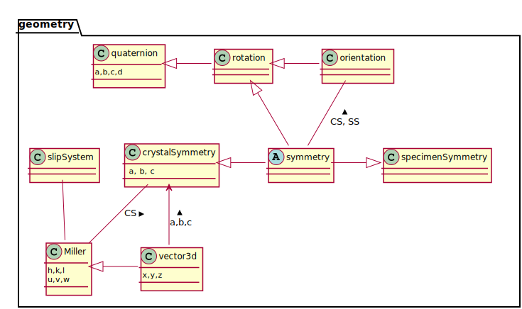

### Getting Started ###

・[Installation Guide](files/doc/installation.html)
・[Configuration](files/doc/configuration.html)
・[Frequently Asked Questions](files/doc/FAQ.html)
・[Release Notes](files/doc/changelog.html)
・[Function Overview](files/doc/funcref_cat.html)
・[Matlab Basics](http://mathworks.com/help/matlab/getting-started-with-matlab.html)・

### Users Guide ###

<table border='0' cellpadding='5' width = "940px" style="width:100%" >
  <tr>
	<th><a href="files/doc/CrystalGeometry.html">Crystal Geometry</a></th>
	<th><a href="files/doc/PoleFigureAnalysis.html">Pole Figures</a></th>
	<th><a href="files/doc/ODFAnalysis.html">ODFs</a></th>
	<th><a href="files/doc/TensorAnalysis.html">Tensors</a></th>
  </tr>
  <tr>
	<td align="center"></td>
	<td align="center"></td>
	<td align="center"></td>
	<td align="center"></td>
  </tr>
  <tr>
  	<th><a href="files/doc/EBSDAnalysis.html">EBSD</a></th>
	<th><a href="files/doc/GrainAnalysis.html">Grains</a></th>
	<th><a href="files/doc/BoundaryAnalysis.html">Grain Boundaries</a></th>
	<th><a href="files/doc/Plotting.html">Plotting</a></th>
  </tr>
  <tr>
	<td align="center"></td>
	<td align="center"></td>
	<td align="center"></td>
	<td align="center"></td>
  </tr>
</table>

<iframe height="750"  width="100%" src="files/puml/geometry.svg" scrolling="no"
   frameborder="0">
   
SVG-Grafik – hier eine Kopie als PNG

   
</iframe>

Alice : foo
Bob<--Alice : foo
">

Alice : dummy
Bob<--Alice : dummy
">
