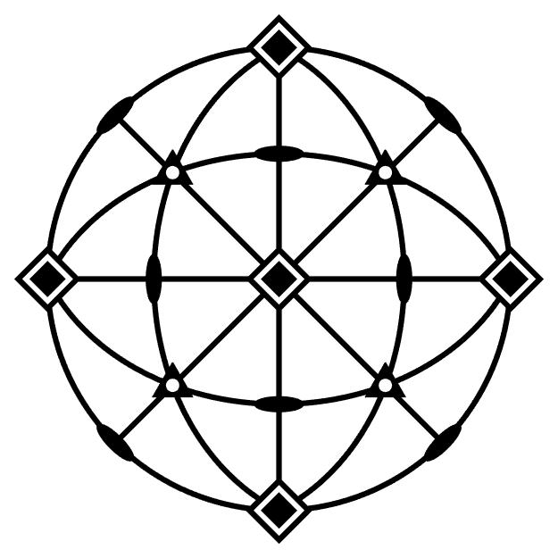
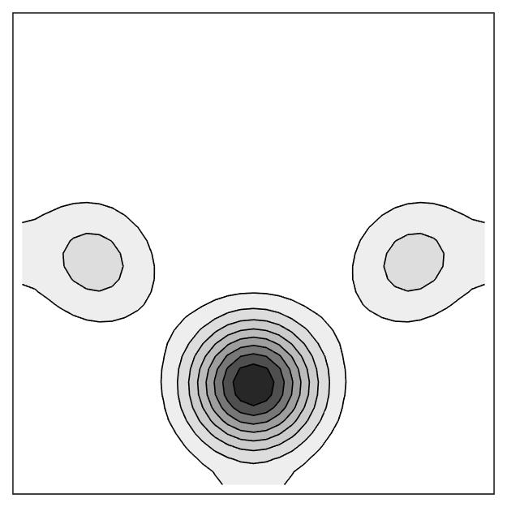
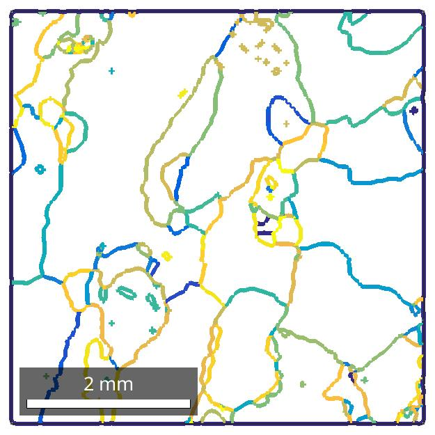
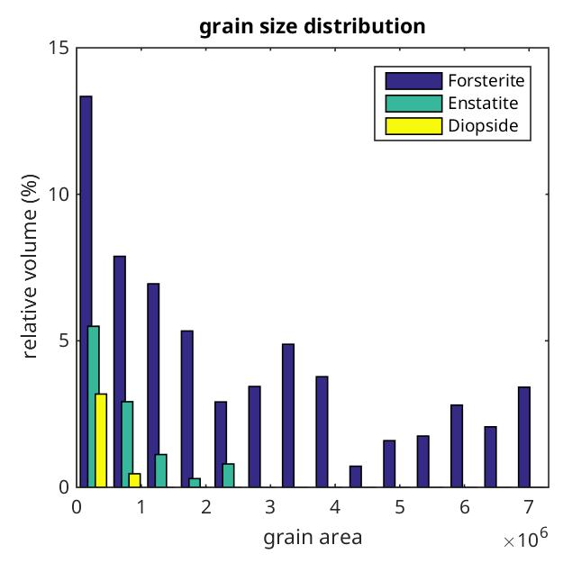

MTEX is a free Matlab toolbox for analyzing and modeling crystallographic
textures by means of EBSD or pole figure data.

### News

* MTEX 4.0.16 released:  ・[Announcement](https://groups.google.com/forum/?fromgroups=#!topic/mtexmail/rlmxbg1dn6Q) ・[Download](https://github.com/mtex-toolbox/mtex/releases/download/mtex-4.0.16/mtex-4.0.16.zip)・[Release Notes](files/doc/changelog.html)・[Installation](download)・
* Chemnitz MTEX Workshop 2015: ・[Announcement](https://groups.google.com/forum/#!topic/mtexmail/bNJLll7UnQA) ・[Homepage](http://www-user.tu-chemnitz.de/~rahi/mtexWorkshop15)・[Registration](http://www-user.tu-chemnitz.de/~rahi/mtexWorkshop15/registration.php)・

### Requirements and Licensing

* MTEX is free and runs in standard Matlab with no toolboxes required. You will
be up and running in seconds.

### Troubleshooting, Bugs, Contact and Mailing List

 * [MTEX forum](https://groups.google.com/forum/?fromgroups=#!forum/mtexmail)
  -- Questions, Discussions, Announcements.
 * [report issues](https://github.com/mtex-toolbox/mtex/issues) -- Every bug
   report is welcome.
 * [contribute](https://github.com/mtex-toolbox/mtex) -- MTEX is open
   source and adding new features is more simple then you might think.

### Users Guide and Feature Overview ###

<table border='0' cellpadding='5' width = "940px" style="width:100%" >
  <tr>
	<th><a href="files/doc/CrystalGeometry.html">Crystal Geometry</a></th>
	<th><a href="files/doc/PoleFigureAnalysis.html">Pole Figures</a></th>
	<th><a href="files/doc/ODFAnalysis.html">ODFs</a></th>
	<th><a href="files/doc/TensorAnalysis.html">Tensors</a></th>
  </tr>
  <tr>
	<td align="center"></td>
	<td align="center"></td>
	<td align="center"></td>
	<td align="center"></td>
  </tr>
  <tr>
  	<th><a href="files/doc/EBSDAnalysis.html">EBSD</a></th>
	<th><a href="files/doc/GrainAnalysis.html">Grains</a></th>
	<th><a href="files/doc/BoundaryAnalysis.html">Grain Boundaries</a></th>
	<th><a href="files/doc/Plotting.html">Plotting</a></th>
  </tr>
  <tr>
	<td align="center"></td>
	<td align="center"></td>
	<td align="center"></td>
	<td align="center"></td>
  </tr>
</table>
