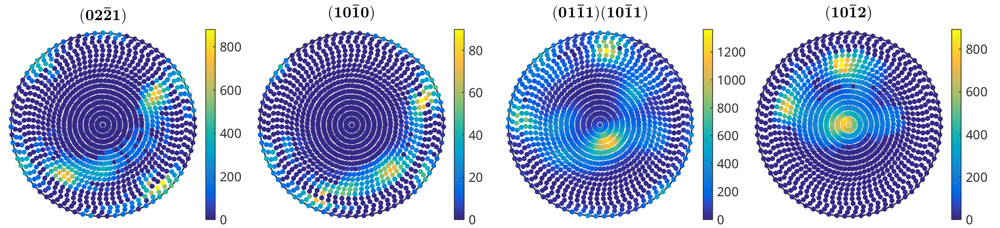
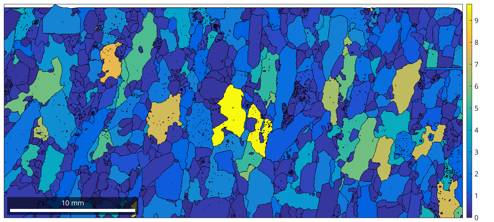
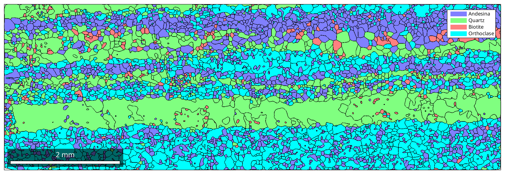
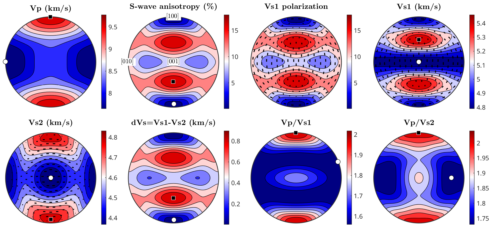

**MTEX** is a free Matlab toolbox for analyzing and modeling crystallographic
textures by means of EBSD or pole figure data.

#### News

* **MTEX 4.0 released**:  ・[**Announcement**](https://groups.google.com/forum/?fromgroups=#!topic/mtexmail/rlmxbg1dn6Q) ・[**Download**](http://www-user.tu-chemnitz.de/~rahi/software)・[**Release Notes**]()・[**Installation**]()・
* **Chemnitz MTEX Workshop 2015**: ・[**Announcement**](https://groups.google.com/forum/#!topic/mtexmail/bNJLll7UnQA) ・[**Homepage**](http://www-user.tu-chemnitz.de/~rahi/mtexWorkshop15)・[**Registration**](http://www-user.tu-chemnitz.de/~rahi/mtexWorkshop15/registration.php)・

#### Requirements and Licensing

MTEX is free and runs in standard Matlab with no toolboxes required. You will
be up and running in seconds.

#### Troubleshooting, Bugs, Contact and Mailing List

 * [**MTEX forum**](https://groups.google.com/forum/?fromgroups=#!topic/mtexmail)
  -- Questions, Discussions, Announcements.
 * [**report issues**](https://github.com/mtex-toolbox/mtex/issues) -- Every bug
   report is welcome.
 * [**contribute**](https://github.com/mtex-toolbox/mtex) -- MTEX is open
   source and adding new features is more simple then you might think.

#### Images

----

----

----

----

